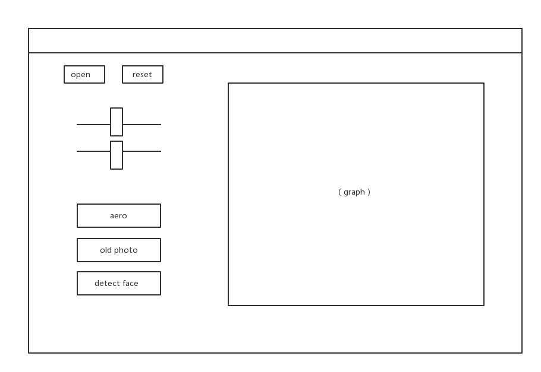

# GraphicsEditor需求文档
## 整体需求
设计一款图像处理软件，能够实现基本的操作如旋转，滤镜，更改对比度，亮度等操作，同时能够结合其他技术实现一些高级操作比如人脸识别，体现MVVM架构的好处

## 界面设计

### 界面说明
- 打开按钮
- 重置按钮
- 需要数个滑条来对图像进行处理，每一个操作对应一个滑槽
- 每一个滤镜对应一个按钮
- 画布应该足够大能够将图片完整地展示

## 使用语言及框架
为了使得该软件能够兼容各种平台（OS X，Linux，Windows），应采用跨平台框架或语言编写，推荐使用C++和Qt5。

## 软件开发流程
### 多人协作
使用github的仓库管理代码，实行多人协作开发 git分支。

### 测试
对GUI进行严格的人工测试
对图像处理算法进行严格的单元测试

## 开发团队
杨晗，王大鑫，方钲清，孙健

