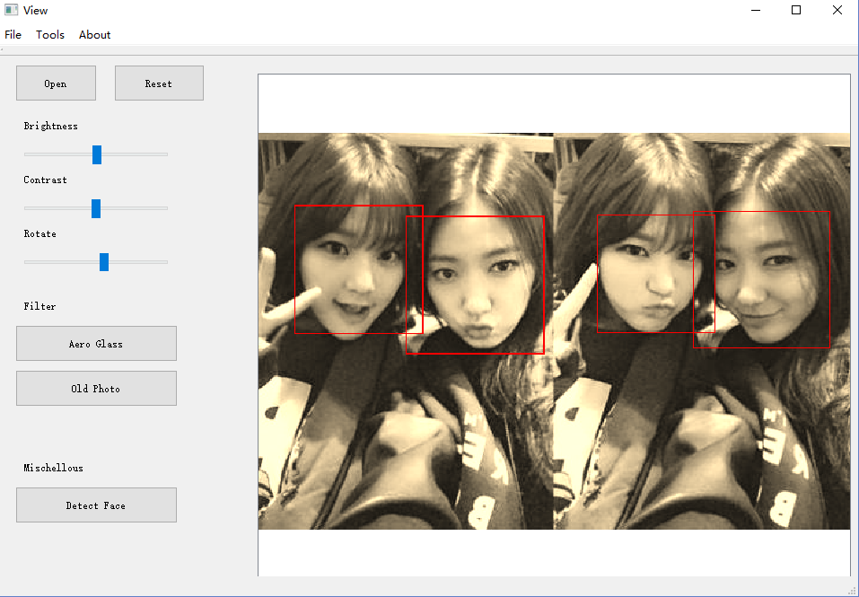
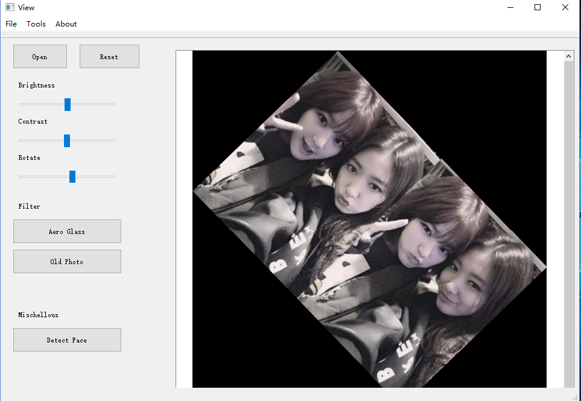
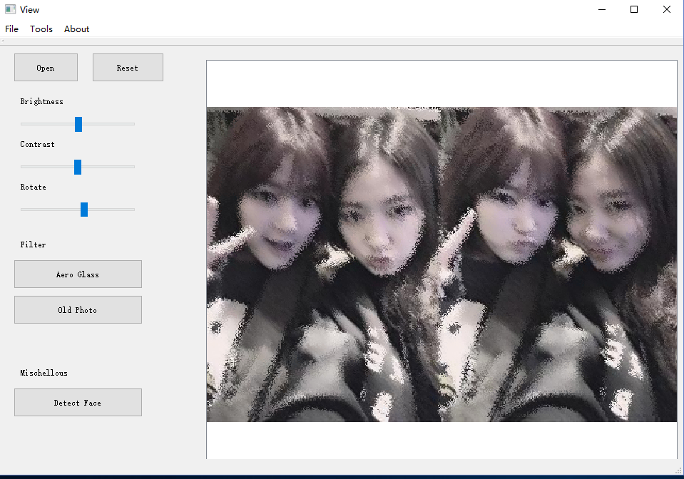
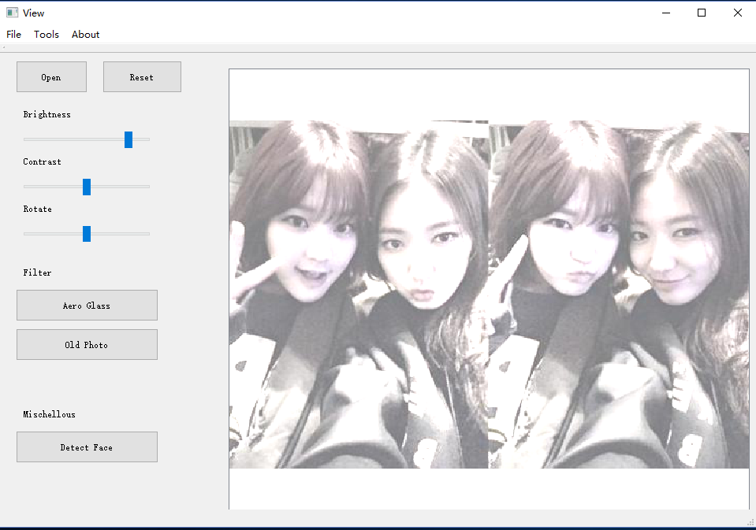

# 架构总体设计

## GraphicsEditor

总体采用MVVM框架设计开发。

### 各模块的职责：

#### App

实现`Model`,`ViewModel`之间以及`ViewModel`,`View`之间的绑定。

#### Model

存储保存cv:Mat格式的数据

#### ViewModel

将Model中的数据转换为QImage格式的数据用于展示

#### View

显示ui布局

显示ViewModel中的数据


### 各模块之间的通信

当在界面上进行一次操作：

1. View 调用ViewModel中的方法，发出Command
2. ViewModel对应的Command调用Model中对应的函数对数据进行处理
3. Model处理完成后通过Notification通知ViewModel更新数据
4. ViewModel数据更新后发出Notification通知View层重新绘制界面


### 功能实现
- [x] 导入打开图片
- [x] 调整对比度
- [x] 调整亮度
- [x] 裁剪
- [x] 旋转
- [x] 滤镜
- [x] 人脸检测

### 功能展示

操作截图可见`./screenshots`。

1. 加载
  
2. detectface
  
3. detectface2 
  
4. oldphoto
  
5. rotate
  
6. aeroglass
  
7. bright
  
8. contrast
  


### 项目目录

```
├── App
├── Commands
├── common
├── GraphicsEditor.pro
├── LICENSE
├── main.cpp
├── Model
├── Notification
├── Parameters
├── README.md
├── View
└── ViewModel
└── docs
    ├── 个人心得
    └── 总体报告.md
```


